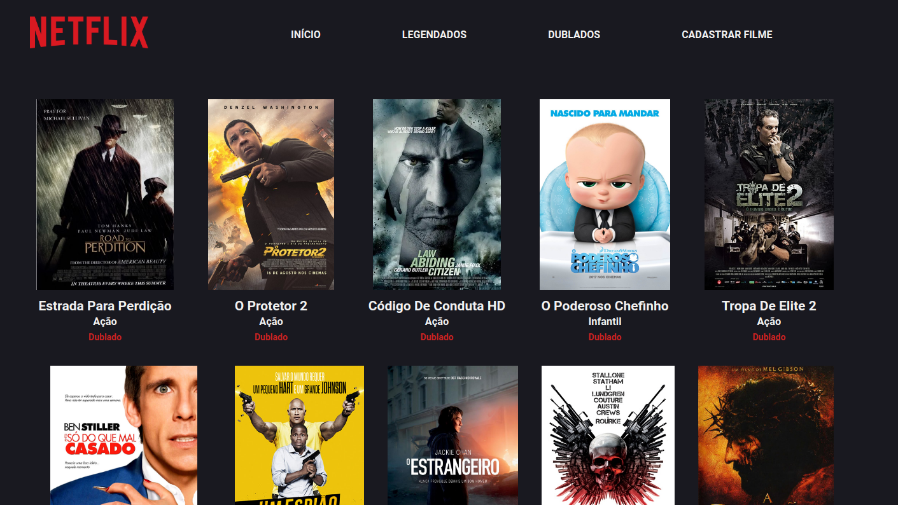
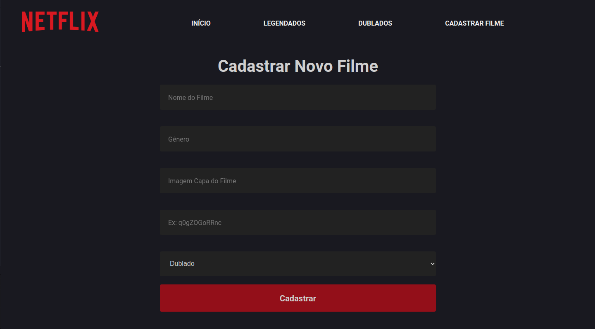
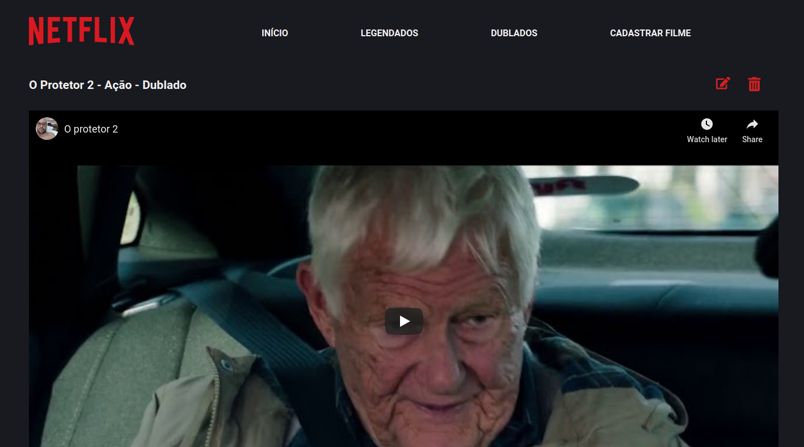

<h1 align="center">
    
    <br>
    GT Movies Platform
</h1>

<h4 align="center">
  Movies Platform builded with Node & React JS
</h4>

<p align="center">
  <a href="#rocket-technologies">Technologies</a>&nbsp;&nbsp;&nbsp;|&nbsp;&nbsp;&nbsp;
  <a href="#information_source-how-To-use">How To Use</a>&nbsp;&nbsp;&nbsp;|&nbsp;&nbsp;&nbsp;
  <a href="#memo-license">License</a>
</p>







## :rocket: Technologies

This Movie Platform was builded using Javascipt at back-end and front-end using technologies like:

-  [ReactJS](https://reactjs.org/)
-  [Redux](https://redux.js.org/)
-  [Redux-Saga](https://redux-saga.js.org/)
-  [React Router v4](https://github.com/ReactTraining/react-router)
-  [Axios](https://github.com/axios/axios)
-  [History](https://www.npmjs.com/package/history)
-  [React-Toastify](https://fkhadra.github.io/react-toastify/)
-  [styled-components](https://www.styled-components.com/)
-  [React-Icons](https://react-icons.netlify.com/)
-  [Knex](http://knexjs.org/)
-  [VS Code][vc] with [EditorConfig][vceditconfig] and [Dracula Theme][dracula]


## :information_source: How To Use

To run this app you should install [Git](https://git-scm.com), [Node.js v10.16][nodejs] or higher + [Yarn v1.13][yarn]. Let's to commands:

### First Steps

```bash
# Clone this repository
$ git clone https://github.com/patryckgratao/GTMovies.git

# Go to downloaded repo
$ cd GTMovies

# Open backend folder and configure your Database
$ cd backend
$ code knexfile.js

# Update fields with your infos
  development: {
    client: 'mysql',
    connection: {
      host: 'localhost',
      user: 'your-user',
      password: 'your-pass',
      database: 'your-database'
    },

# Save the file
```

### Running Backend
```bash
# Go to backend folder
$ cd backend

# Install dependencies
$ yarn install

# Run backend
$ yarn

```

### Running Frontend
```bash

# Go to frontend folder
$ cd ../frontend

# Install dependencies
$ yarn install

# Run the app
$ yarn start
```

### Well Done, now your app is ready to use.


## :memo: Licença
This project is under MIT license.

---

Made with :heartpulse: by Patryck Gratão.

[nodejs]: https://nodejs.org/
[yarn]: https://yarnpkg.com/
[vc]: https://code.visualstudio.com/
[vceditconfig]: https://marketplace.visualstudio.com/items?itemName=EditorConfig.EditorConfig
[vceslint]: https://marketplace.visualstudio.com/items?itemName=dbaeumer.vscode-eslint
[dracula]: https://draculatheme.com/
